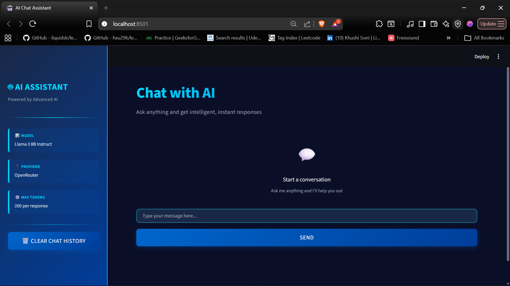
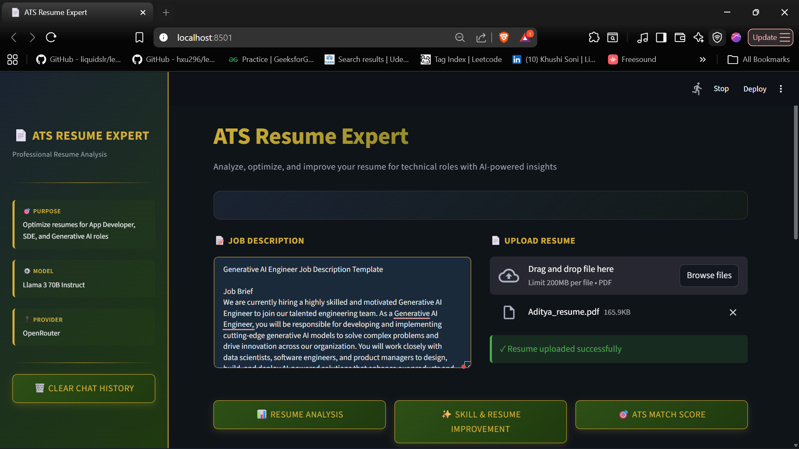
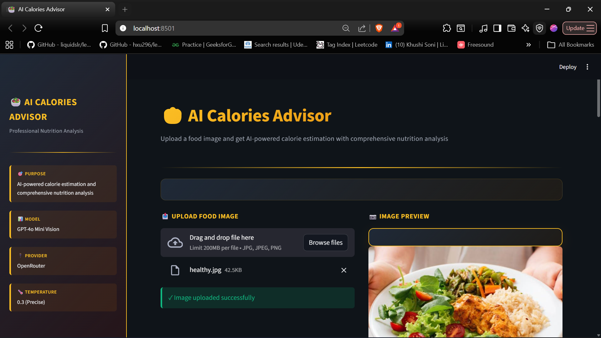
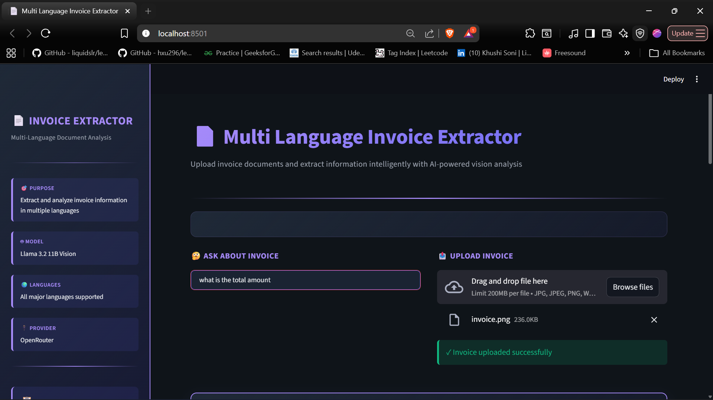
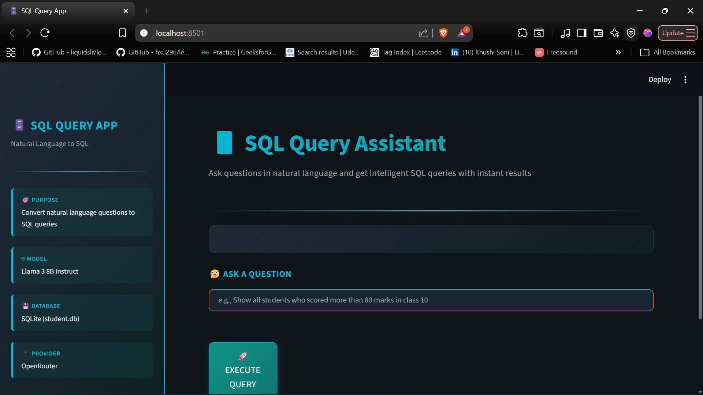
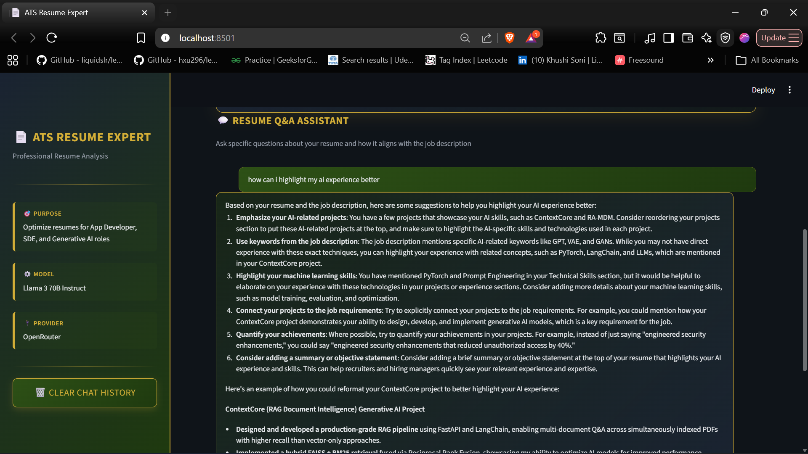
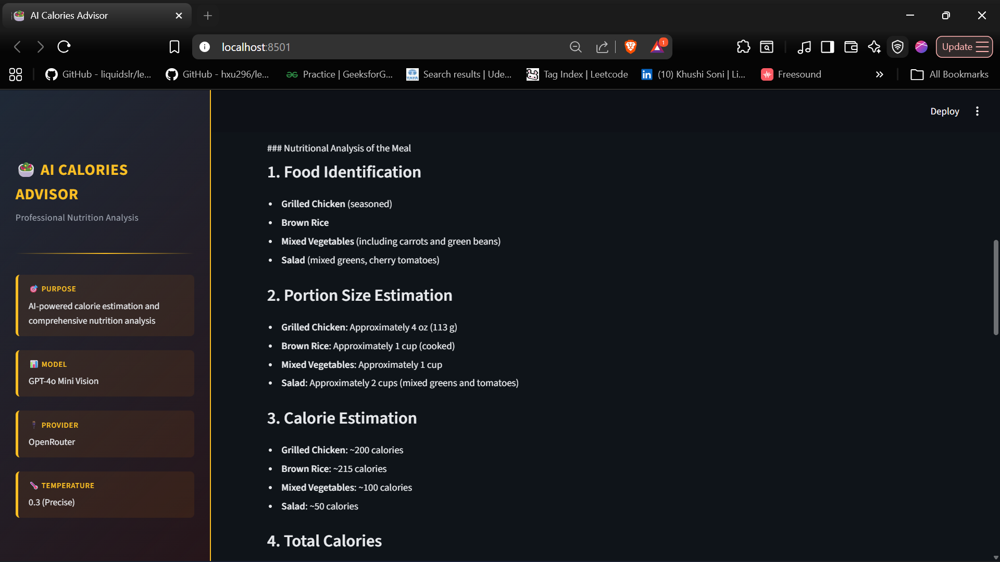
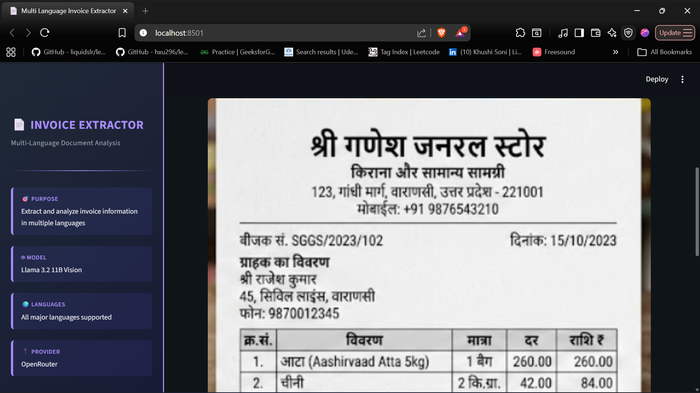
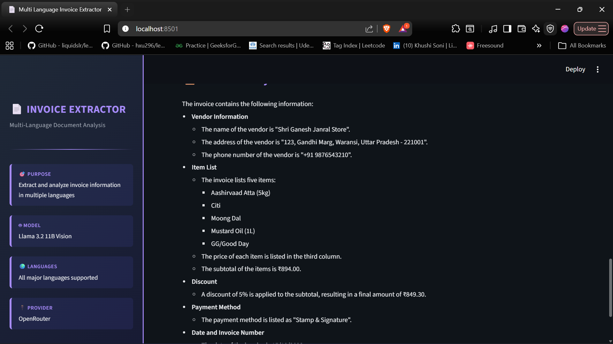
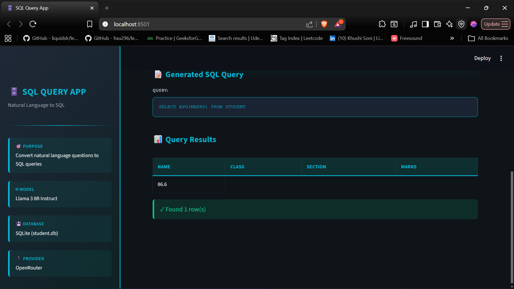

# Generative AI Applications Suite

<div align="center">


A comprehensive collection of production-ready AI applications showcasing modern Generative AI capabilities

</div>

---

## Overview

This repository contains 10+ professional-grade generative AI applications built with cutting-edge LLM technologies. Each project demonstrates real-world use cases, clean architecture, and production-ready UI/UX design.

Suitable for:
- Generative AI interns and developers
- Portfolio building and recruitment
- Enterprise AI application templates
- Advanced AI integration learning

---

## Projects Overview

### 1. AI Chat Assistant
**Smart conversational AI application**

- Model: Llama 3 8B Instruct (OpenRouter)
- Features: Multi-turn conversations, session management, clean message history
- Design: Modern Blue and Cyan theme with smooth animations
- Interface: Professional chat interface with real-time responses
- Use Case: General-purpose conversational AI

**Key Technologies**: Streamlit, OpenAI SDK, LangChain, Python

---

### 2. ATS Resume Analyzer
**AI-powered resume screening and optimization**

- Model: Llama 3 70B Instruct (OpenRouter)
- Features:
  - Resume Analysis Report
  - Skill and Resume Improvement Suggestions
  - ATS Match Score Calculation
  - Interactive Resume Q&A Assistant
- Design: Professional Green and Gold theme
- Interface: Multi-page analysis with detailed insights

**Analyzes**:
- Technical Skills Evaluation
- Project Assessment
- Work Experience Relevance
- ATS Optimization
- Missing Skills Gaps
- Hiring Recommendations

Best For: App Developers, SDE, Generative AI roles

---

### 3. AI Calories Advisor
**End-to-end nutritionist AI with vision capabilities**

- Model: GPT-4o Mini Vision (OpenRouter)
- Features:
  - Food image analysis
  - Calorie estimation
  - Nutritional breakdown (Protein, Carbs, Fats, Fiber)
  - Health evaluation and diet advice
  - Fitness recommendations (Weight loss, Muscle gain, Maintenance)
- Design: Vibrant Orange and Red food theme
- Interface: Image upload with professional analysis cards

**Advanced Analysis**:
- Portion size estimation
- Macronutrient breakdown
- Health impact assessment
- Personalized suggestions

---

### 4. Multi-Language Invoice Extractor
**Vision-based document analysis with multi-language support**

- Model: Llama 3.2 11B Vision (OpenRouter)
- Features:
  - Multi-language invoice analysis
  - Intelligent Q&A on invoice content
  - Vendor and customer extraction
  - Amount and tax calculation
  - Line item analysis
- Design: Professional Purple and Indigo theme
- Interface: Document preview with structured analysis

Supports: All major languages, multiple invoice formats

---

### 5. SQL Query Assistant
**Natural language to SQL query generator**

- Model: Llama 3 8B Instruct (OpenRouter)
- Features:
  - Natural language question input
  - Automatic SQL query generation
  - Query execution and results display
  - Formatted results table
  - Database schema reference
- Design: Tech Teal and Cyan theme
- Interface: Query display with professional data tables

Supports: SQLite, structured data retrieval

---

### 6. YouTube Transcriber
**YouTube video to text transcription with AI processing**

- Features:
  - YouTube video URL input
  - Automatic transcript extraction
  - Text summarization
  - Key points extraction
  - Searchable transcript interface
- Use Case: Content analysis, research, accessibility

**Technologies**: YouTube API, Speech Recognition, Text Processing

---

### 7. Vision Application
**Advanced computer vision and image analysis**

- Features:
  - Image classification
  - Object detection
  - Scene understanding
  - Image captioning
  - Visual Q&A
- Design: Professional visual analytics interface
- Use Case: Image understanding and analysis

**Technologies**: PyTorch, TensorFlow, PIL, Computer Vision

---

### 8. Chat with Multiple PDF
**Advanced PDF processing with conversational AI**

- Model: Llama 3 8B Instruct (OpenRouter)
- Features:
  - Multiple PDF upload support
  - Document indexing and retrieval
  - Conversational Q&A over documents
  - Citation and reference tracking
  - Document summarization
- Design: Professional document interface
- Use Case: Document analysis, research, knowledge extraction

**Technologies**: PyPDF2, FAISS, LangChain, Embeddings

---

### 9. Crew AI Agents
**Multi-agent AI system for complex task automation**

- Features:
  - Multi-agent orchestration
  - Task delegation and execution
  - Collaborative problem solving
  - Agent-to-agent communication
  - Workflow automation
- Design: Advanced task management interface
- Use Case: Complex workflow automation, research, analysis

**Technologies**: LangChain Agents, Multi-agent systems, Tool integration

---

### 10. Text2SQL
**Advanced text to SQL conversion with database management**

- Model: Llama 3 8B Instruct (OpenRouter)
- Features:
  - Natural language to SQL conversion
  - Query optimization
  - Database schema understanding
  - Complex query generation
  - Result formatting and visualization
- Design: Professional database interface
- Use Case: Database querying, data analysis, reporting

**Technologies**: SQLite, SQL parsing, LangChain

---

### 11. QA Chat
**Question-answering system with context awareness**

- Model: Llama 3 8B Instruct (OpenRouter)
- Features:
  - Context-aware Q&A
  - Multi-turn conversations
  - Knowledge base integration
  - Answer ranking and relevance
  - Conversation history management
- Use Case: FAQ systems, knowledge retrieval, support

**Technologies**: LangChain, Embeddings, Vector databases

---

## Project Showcase

### Applications Dashboard
<table>
  <tr>
    <td align="center" width="200">
      
      <br>
      <b>AI Chat Assistant</b><br>
      <sub>Conversational AI</sub>
    </td>
    <td align="center" width="200">
      
      <br>
      <b>ATS Resume Analyzer</b><br>
      <sub>Resume Analysis</sub>
    </td>
    <td align="center" width="200">
      
      <br>
      <b>AI Calories Advisor</b><br>
      <sub>Nutrition AI</sub>
    </td>
    <td align="center" width="200">
      
      <br>
      <b>Invoice Extractor</b><br>
      <sub>Document Analysis</sub>
    </td>
    <td align="center" width="200">
      
      <br>
      <b>SQL Query Assistant</b><br>
      <sub>AI Database</sub>
    </td>
  </tr>
</table>

### Detailed Screenshots

| AI Chat App | ATS Resume (1) | ATS Resume (2) |
|:--:|:--:|:--:|
|  |  |  |

| Calories Advisor (1) | Calories Advisor (2) | Invoice Extractor (1) |
|:--:|:--:|:--:|
|  |  |  |

| Invoice Extractor (2) | Invoice Extractor (3) | SQL Query (1) |
|:--:|:--:|:--:|
|  |  |  |

| SQL Query (2) |
|:--:|
|  |

---

## Key Features

### Comprehensive AI Solutions
- 10+ Production-Ready Applications with real-world use cases
- Vision Capabilities for image and document analysis
- Multi-Language Support for global applications
- Advanced NLP for conversation and text analysis
- Multi-agent systems for complex task automation

### Professional UI/UX
- Unique Theme for Each Project (Blue, Green, Orange, Purple, Teal)
- Responsive Design optimized for all devices
- Smooth Animations and modern interactions
- Accessibility First with clear typography and contrast

### Production-Ready Code
- Clean Architecture with separation of concerns
- Error Handling and validation throughout
- Session Management for stateful applications
- Scalable Design ready for enterprise deployment

### Advanced Integrations
- OpenRouter API for LLM access
- LangChain for prompt management and agents
- Streamlit for rapid UI development
- Vision Models for image understanding
- PDF and document processing
- Database integration and querying

---

## Tech Stack

### Core Technologies
```
Python 3.9+
Streamlit 1.28+
LangChain 0.1+
OpenAI SDK 1.0+
```

### AI/ML Stack
```
LLM: Llama 3 (8B, 11B, 70B variants)
Vision: GPT-4o Mini, Llama Vision
Provider: OpenRouter API
Agents: LangChain Agents, Multi-agent systems
Temperature: Optimized per task (0 - 0.7)
```

### Supporting Libraries
```
sqlite3 - Database management
PIL/Pillow - Image processing
PyPDF2 - PDF text extraction
python-dotenv - Environment management
FAISS - Vector similarity search
youtube-transcript-api - YouTube transcription
```

### Infrastructure
```
Streamlit Cloud / Self-hosted
Git and GitHub
Environment Variables (.env)
```

---

## Project Structure

```
gen-ai-projects/
|
|-- README.md                                    # Main documentation
|-- SETUP_GUIDE.md                              # Detailed setup guide
|-- QUICK_REFERENCE.md                          # Quick reference guide
|-- requirements.txt                            # Python dependencies
|-- .env.example                                # Environment template
|-- .gitignore                                  # Git ignore rules
|
|-- ai_chat_app_enhanced.py                    # AI Chat Assistant
|-- ats_resume_checker_enhanced.py             # ATS Resume Analyzer
|-- ai_calories_advisor_enhanced.py            # Calories Advisor
|-- multi_language_invoice_extractor_enhanced.py
|-- sql_query_app_enhanced.py                  # SQL Query Assistant
|-- YTtranscriber.py                           # YouTube Transcriber
|-- vision.py                                  # Vision Application
|-- chat_with_multiple_pdf.py                  # PDF Chat Application
|-- crew_ai_agents.py                          # Crew AI Agents
|-- text2sql.py                                # Text to SQL
|-- qachat.py                                  # QA Chat Application
|
|-- screenshots/                               # Project screenshots
|   |-- ai_chat_app.png
|   |-- ats_01.png
|   |-- ats_02.png
|   |-- calorie_01.png
|   |-- calorie_02.png
|   |-- invoice_01.png
|   |-- invoice_02.png
|   |-- invoice_03.png
|   |-- sql_01.png
|   |-- sql_02.png
|
|-- student.db                                 # Sample database
```

---

## Setup and Installation

### Prerequisites
- Python 3.9 or higher
- pip package manager
- OpenRouter API key (free tier available)
- Git

### Step 1: Clone Repository
```bash
git clone https://github.com/Aditya-dev2005/gen-ai-projects.git
cd gen-ai-projects
```

### Step 2: Create Virtual Environment
```bash
python -m venv venv

# On Windows
venv\Scripts\activate

# On macOS/Linux
source venv/bin/activate
```

### Step 3: Install Dependencies
```bash
pip install -r requirements.txt
```

### Step 4: Setup Environment Variables
```bash
# Create .env file
cp .env.example .env

# Add your OpenRouter API key
OPENROUTER_API_KEY=your_api_key_here
```

### Step 5: Run Applications

**AI Chat Assistant**
```bash
streamlit run ai_chat_app_enhanced.py
```

**ATS Resume Analyzer**
```bash
streamlit run ats_resume_checker_enhanced.py
```

**Calories Advisor**
```bash
streamlit run ai_calories_advisor_enhanced.py
```

**Invoice Extractor**
```bash
streamlit run multi_language_invoice_extractor_enhanced.py
```

**SQL Query Assistant**
```bash
streamlit run sql_query_app_enhanced.py
```

**YouTube Transcriber**
```bash
streamlit run YTtranscriber.py
```

**Vision Application**
```bash
streamlit run vision.py
```

**Chat with Multiple PDF**
```bash
streamlit run chat_with_multiple_pdf.py
```

**Crew AI Agents**
```bash
streamlit run crew_ai_agents.py
```

**Text2SQL**
```bash
streamlit run text2sql.py
```

**QA Chat**
```bash
streamlit run qachat.py
```

---

## Requirements

```
streamlit==1.28.1
python-dotenv==1.0.0
openai==1.3.5
langchain==0.1.0
langchain-openai==0.1.0
pillow==10.0.0
pypdf2==3.0.1
requests==2.31.0
faiss-cpu==1.7.4
youtube-transcript-api==0.6.1
torch==2.0.0
torchvision==0.15.0
```

Install all at once:
```bash
pip install -r requirements.txt
```

---

## Learning Outcomes

This project suite demonstrates:

### AI/ML Concepts
- LLM integration and prompt engineering
- Vision model capabilities
- Multi-turn conversation management
- Temperature and parameter tuning
- Token optimization
- Multi-agent systems and orchestration
- Vector embeddings and similarity search
- Document indexing and retrieval

### Software Engineering
- Clean code practices
- Error handling and validation
- Session state management
- Modular architecture
- UI/UX best practices
- API integration patterns

### Production Readiness
- API integration
- Environment configuration
- Scalable design patterns
- User experience optimization
- Performance considerations
- Security best practices

---

## Use Cases

| Project | Industry | Use Case |
|---------|----------|----------|
| AI Chat | Customer Service, Support | 24/7 automated assistance, FAQs |
| ATS Resume | HR Tech, Recruitment | Resume screening, skill matching |
| Calories Advisor | Health Tech, Fitness | Nutrition analysis, diet planning |
| Invoice Extractor | FinTech, Accounting | Document processing, data extraction |
| SQL Query | Data Analytics, Business Intelligence | Natural language queries, reporting |
| YT Transcriber | Media, Education | Video transcription, content analysis |
| Vision | Computer Vision, Analysis | Image understanding, classification |
| Chat PDF | Research, Knowledge Management | Document analysis, knowledge extraction |
| Crew AI Agents | Automation, Research | Complex task automation, workflows |
| Text2SQL | Database Management, Analytics | Advanced querying, data analysis |
| QA Chat | Support, Knowledge Bases | Question answering, information retrieval |

---

## Key Achievements

- 10+ Production Applications built with modern AI
- Professional UI/UX with consistent design language
- Advanced Features including vision, NLP, agents, and database integration
- Scalable Architecture ready for enterprise use
- Comprehensive Documentation for easy deployment

---

## Security and Privacy

- API keys stored in .env (never committed)
- No sensitive data stored in code
- Input validation on all user inputs
- Secure API communication
- Environment-based configuration

---

## Future Enhancements

- Multi-language support for all applications
- Advanced caching with Redis
- Database integration for persistent storage
- User authentication and profiles
- Rate limiting and API monitoring
- Deployment to cloud platforms
- Mobile application versions
- Advanced analytics and logging
- Real-time collaboration features
- Advanced monitoring and alerting

---

## Contributing

Contributions are welcome. Please:

1. Fork the repository
2. Create a feature branch (git checkout -b feature/amazing-feature)
3. Commit changes (git commit -m 'Add amazing feature')
4. Push to branch (git push origin feature/amazing-feature)
5. Open a Pull Request

---

## License

This project is licensed under the MIT License. See the LICENSE file for details.

---

## About the Developer

Generative AI intern passionate about building intelligent applications with cutting-edge technology. This portfolio showcases real-world AI application development, modern UI/UX design, and production-ready code practices.

### Skills Demonstrated
- AI/ML: LLM integration, prompt engineering, vision models, multi-agent systems
- Backend: Python, LangChain, API integration, database management
- Frontend: Streamlit, modern UI/UX design, responsive interfaces
- Tools: Git, environment management, debugging, performance optimization
- Concepts: Clean architecture, error handling, scalability, security

---

## Contact and Support

- Email: adichat571@gmail.com
- LinkedIn: [Aditya Chaturvedi](https://www.linkedin.com/in/aditya-chaturvedi05/)
- GitHub: [Aditya Chaturvedi](https://github.com/Aditya-dev2005)

---

## Acknowledgments

- OpenRouter for LLM API access
- Streamlit for rapid development framework
- LangChain for prompt management and agent orchestration
- The open-source AI community

---

<div align="center">

If you found this helpful, please consider giving it a star

Built with commitment by an AI Enthusiast

</div>
